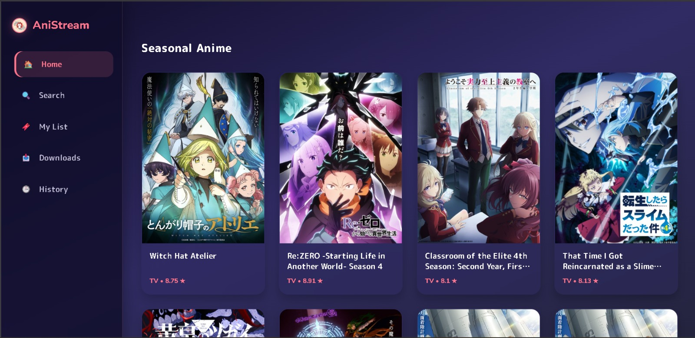

# 🦊 AniStream — Premium Anime Desktop Experience
> **The Fast, Private, and Portable MAL-Integrated Streamer for Windows**

[](../../releases)
[](../../releases)
[](#-privacy--scraping)
[](LICENSE.txt)

AniStream is a high-performance, **zero-ad**, and **100% portable** anime streaming desktop application. Built for fans who value speed and privacy, it bridges your **MyAnimeList** library directly with a high-quality streaming engine and the legendary **MPV player**.

<p align="center">
  
</p>

**Developed by [@3cstat1c.fl](https://instagram.com/3cstat1c.fl)**

---

## ✨ Features

- **100% Portable** — Everything bundled. No installation required for the portable version.
- **MAL Integration** — OAuth-based MyAnimeList sync for tracking episodes.
- **Multi-Source Resolver** — Automatically finds streams from multiple providers with title normalization (JP ↔ EN).
- **MPV Player** — Hardware-accelerated playback with full HLS/DASH support.
- **Quality Cascade** — Automatically falls back through 1080p → 720p → 480p if your preferred quality isn't available.
- **System Health Dashboard** — Real-time diagnostics for all dependencies (MPV, FFmpeg, Git Bash, Browser).
- **Modern UI** — Dark theme with Japanese aesthetic. Responsive and snappy.

---

## 🚀 Quick Start (Users)

### Option A: Installer
1. Download `AniStream_Setup_v1.0.0.exe` from [Releases](../../releases)
2. Run the installer, choose your install directory
3. Launch AniStream from your desktop or Start Menu

### Option B: Portable
1. Download the portable `.zip` from [Releases](../../releases)
2. Extract anywhere
3. Double-click `AniStream.exe`

---

## 🛠️ Development Setup

### Prerequisites
- Node.js 18+
- npm

### Install & Run
```bash
git clone https://github.com/YOUR_USERNAME/anistream.git
cd anistream
npm install
```

> **Important**: The stream resolver (`src/services/stream.js`) is not included in this repo. Copy `src/services/stream.example.js` to `stream.js` and implement your own providers.

```bash
cp src/services/stream.example.js src/services/stream.js
# Edit stream.js with your provider implementations
npm start
```

The app will launch at `http://localhost:6969`.

### Build Portable EXE
```powershell
.\scripts\clean.ps1
.\scripts\build-portable.ps1
```

### Build Installer
Open `installer/setup.iss` in [Inno Setup](https://jrsoftware.org/isinfo.php) and click Compile.

---

## 📁 Project Structure

```
anistream/
├── src/
│   ├── main.js              # Entry point, PATH injection
│   ├── server.js             # Express server setup
│   ├── tray.js               # System tray integration
│   ├── frontend/             # HTML/CSS/JS frontend
│   │   ├── index.html        # Main app shell
│   │   └── pages/            # Sub-pages (settings, etc.)
│   ├── routes/               # Express API routes
│   └── services/             # Core business logic
│       ├── stream.example.js # Stream resolver template
│       ├── jikan.js          # MAL/Jikan API client
│       ├── mal.js            # MyAnimeList OAuth
│       ├── settings.js       # App settings manager
│       ├── history.js        # Watch history
│       └── downloads.js      # Download manager
├── scripts/
│   ├── build-portable.ps1    # Full build pipeline
│   ├── bundle.js             # esbuild config
│   ├── clean.ps1             # Pre-build cleanup
│   └── sign.ps1              # Self-signing utility
├── installer/
│   └── setup.iss             # Inno Setup config
├── assets/
│   └── fox_mask.ico          # App icon
├── TODO.md                   # Roadmap & future plans
└── LICENSE.txt
```

---

## 🔒 Privacy & Scraping

The stream resolver implementation is **intentionally excluded** from this repository to protect upstream anime providers from targeted blocking. The `stream.example.js` template documents the interface for anyone who wants to implement their own providers.

---

## 📜 License

MIT License — see [LICENSE.txt](LICENSE.txt)

---

<p align="center">
  Made with ❤️ by <a href="https://instagram.com/3cstat1c.fl">@3cstat1c.fl</a>
</p>
